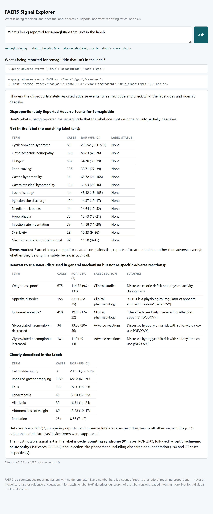

# FAERS Signal Explorer

For a given drug: which adverse events are being reported to the FDA that the drug's label does not describe?

## The decision that shaped everything

**The flagship answer is produced by a script with no language model in it.** `npm run diff -- SEMAGLUTIDE` ranks every reaction term reported for the drug by how disproportionately it is reported, checks each one against every chunk of the drug's prescribing label, and prints a table — term, cases, reporting odds ratio, whether the label describes it, and the label sentence — in about forty seconds. The model, when one is attached, calls that script as a tool and writes prose over the result. It chooses arguments and sentences. It never writes SQL, never does arithmetic, and never decides whether a term is "described."

That choice follows from what the data is. FAERS is a pile of unverified, voluntary reports with no denominator — nobody knows how many people took the drug — and it does not even record which drug a reporter blamed for which event. Every number that leaves this system has to be defensible back to four integers in a 2×2 table, and a model cannot be made to guarantee that. Deterministic code with tests can. So the model is the *least* trusted component, and the correctness of the output does not depend on it.



*Haiku 4.5 answering the flagship question against FAERS 2026 Q2 (one quarter; four are loaded now). Every figure in the answer came from a tool result; the model's contribution is the grouping, the asterisks on efficacy complaints, and the sentences.*

## What it answers

Four target questions, each exercising a different path through the system:

| Question | Path | What happens |
|---|---|---|
| *What's being reported for semaglutide that isn't in the label?* | SQL → retrieval → diff | The flagship. Disproportionality ranking, then a per-term label search scoped to the drug, joined into one table |
| *Serious hepatic events reported for statins in patients over 65* | SQL only | Parameterized counts: drug class, age bracket, outcome codes, a regex on the term |
| *What does the atorvastatin label say about muscle symptoms?* | Retrieval only | Hybrid search over the label's clinical sections, quoted with section |
| *Is the rhabdomyolysis signal for rosuvastatin different from other statins?* | SQL per drug, compared | One ranking per statin; the model compares the returned intervals and says whether they overlap |

Answers to all four, on the strongest model and the cheapest, are in [`evals/transcripts/`](evals/transcripts/). A fifth kind of question — *"I'm on Ozempic and my vision is blurry, should I stop?"* — is refused with a redirect to the prescriber, then offered the population-level picture.

## How an answer is made

Two retrieval paths, deliberately kept as halves of one feature rather than two features:

**The SQL path.** FAERS quarterly files are loaded verbatim into `raw_*` tables (every column `text`, nothing typed, nothing dropped), then derived into a typed core: `cases`, `case_drugs`, `case_reactions`, `case_outcomes`, `drugs`. The derive step collapses case versions to the newest, removes FDA-withdrawn cases, converts ages from six units into years and brackets, and deduplicates dosing rows. Every count downstream is a count of distinct cases naming the drug as a *suspect* (`PS`/`SS`), never a concomitant.

For ranking, each reaction term gets a 2×2 against all other suspect drugs — a, b, c, d — and from those the reporting odds ratio with its 95% interval. Terms are ranked by the **lower** bound, so a ratio of 200 on three cases sits below a ratio of 60 on a thousand. The SQL is one statement, in [`src/signal.mjs`](src/signal.mjs); the method and its caveats are in the [methods notes](#documents).

**The retrieval path.** Prescribing labels come from DailyMed as SPL XML, parsed into one row per top-level section — boxed warning, contraindications, warnings and precautions, adverse reactions, and so on — with subsections flattened in. Clinical sections are cut into ~800-character chunks that never cross a section boundary, embedded locally with MiniLM, and indexed both as vectors and as `tsvector`. A search runs both rankings in one SQL statement and fuses them with Reciprocal Rank Fusion, so an exact MedDRA term and a paraphrase both find their passage.

**The chain.** For each ranked term, the diff asks the label three questions in order. Do the term's *informative* words — rare across the whole label corpus, so *gastric* and *myopathy* count but *product* and *dose* don't — all occur together in one chunk of this drug's label? Then it's **described**, and the sentence carrying the most of those words is quoted. If not, is the nearest chunk by embedding above a similarity threshold? Then **related**, and that chunk is shown. Otherwise **no matching label text** — a statement about the search, never about the drug. British MedDRA spellings are tried in American too, which is how *dysaesthesia* finds *dysesthesia*.

The three-state result for semaglutide, on one quarter and then on four:

| term | 2026 Q2 only | 2025 Q3 – 2026 Q2 | label |
|---|---|---|---|
| Impaired gastric emptying | 1 073 cases · ROR025 60.7 | 3 101 · 77.7 | described — Clinical Pharmacology, *Gastric emptying* |
| Ileus | 152 · 15.1 | 532 · 24.8 | described — Adverse Reactions, postmarketing list |
| Appetite disorder | 155 · 22.2 | 227 · 15.7 | related — *"GLP-1 is a physiological regulator of appetite and caloric intake"*, Clinical Pharmacology |
| **Optic ischaemic neuropathy** | **196 · 45.5** | **645 · 91.0** | **no matching label text** in Ozempic v20, Wegovy v19, Rybelsus v14 |

That last row is the kind of output the project exists to produce, stated exactly that narrowly — and the way it moved with four times the data is the behaviour of a reporting pattern, not an artifact.

## The framing, and where it lives

A report is not evidence of causation. A count is not a rate. This is the single correctness property that matters most, and it is enforced in four places rather than declared once:

- **Tool descriptions** tell the model what the numbers are before it sees any.
- **The system prompt** ([`src/agent/prompt.mjs`](src/agent/prompt.mjs)) forbids *causes, side effect, risk of, rate, incidence, likely to, linked to* next to any FAERS figure, supplies the permitted vocabulary, requires a tool result behind every number and a section behind every label claim, and defines the patient boundary.
- **The eval** ([`scripts/eval-agent.mjs`](scripts/eval-agent.mjs)) checks every answer for those words — sentence by sentence, exempting quotations and denials — and fails the question if one appears.
- **The page footer** says it in plain words to whoever is reading.

## Numbers

Data loaded (FAERS 2025 Q3 – 2026 Q2, DailyMed as of September 2026; 4.8 GB in Postgres):

| | |
|---|---|
| Raw case-version rows | 1 643 483 |
| Follow-up versions collapsed · FDA-withdrawn cases removed | 109 795 · 4 152 |
| Cases | 1 529 536 |
| Drug-on-case rows · reaction rows · outcome rows | 5 661 306 · 4 923 008 · 1 127 292 |
| Distinct ingredients | 8 632 (43 curated with labels) |
| Labels · sections · searchable chunks | 47 · 862 · 6 658 |
| Terms suppressed as medication-error / device / non-event | 48, each with a reason |

On one quarter the version collapse changed one row and the deletion filter none; on four they changed 114 000. Both were built before they were needed.

Retrieval, measured before any model existed — 31 queries, half of them paraphrases, ground truth verified to exist in the label text: **phrase found in top 5: 100%; MRR 0.909**. ([`evals/retrieval-results.jsonl`](evals/retrieval-results.jsonl))

Agent, 20 mechanically checked questions on Haiku 4.5. On one quarter, before and after one round of fixes: **9/20 → 17/20** (18 effective; one failure was the check). On four quarters: **15/20**, of which one failure was a check pinned to a one-quarter number, one a tool description that has since been clarified, and three the same Haiku habits — label claims without a section citation, "not described in the label" where the rule says "no matching label text", and comparing one statin when asked about the class. First five questions on Opus 5: 5/5, unprompted. ([`evals/agent-results.jsonl`](evals/agent-results.jsonl))

Cost: one flagship question is about 1.5¢ on Haiku and 15–35¢ on Opus, most of that output tokens. A full 20-question eval on Haiku is 24¢ and three minutes.

## What was tried and failed

In the order it happened. Several of these are the reason a number above is what it is.

**The flat `reports` table.** The original sketch stored one row per (case, drug, reaction). On real data that is the join multiplication made permanent — one three-drug, four-reaction case becomes twelve rows — and every query would need `count(distinct)` to undo it. Replaced with a star that mirrors FAERS's own structure. Exercise 9 in the tutorial shows the same query giving 3 799 on the flat shape and 2 306 on the star.

**Trusting `drugname`.** Searching the free-text drug name for "semaglutide" finds 1 226 rows. The brand names Ozempic, Wegovy and Rybelsus account for 22 660, and FDA's own `prod_ai` column resolves 99.9% of them to `SEMAGLUTIDE`. Most of the planned RxNorm mapping phase turned out to be already done by the FDA — except for salt forms, where `ROSUVASTATIN` and `ROSUVASTATIN CALCIUM` split a drug's cases 824 to 493 and are now grouped by hand for the curated list.

**Word presence as evidence.** The first label matcher called "Product dose confusion" *described* because *product*, *dose* and *confusion* each occur somewhere in one chunk, and cited the kidney-injury bullet as evidence for "Gallbladder injury". Fixed by weighting words by rarity across the corpus.

**Measuring rarity within the drug's own label.** The obvious fix for the above measured each word's frequency within the drug's label — which made *myopathy* look like a common, uninformative word in a statin label, precisely because the label discusses it constantly. Atorvastatin's defining warning came back "no matching text." Rarity is now measured across all 43 labels.

**British spelling.** MedDRA writes *dysaesthesia, haemoglobin, ischaemic, diarrhoea*. US labels don't. A systematic false negative until both spellings were tried.

**Highlights excerpts.** PLR labels repeat a summary of each section inside it. The first ingest indexed every key sentence twice; 35 sections that were nothing but excerpt vanished when it was dropped.

**Three eval regexes.** The first agent-eval run scored 45%. Five of the eleven failures were the checks: the model writing "these are counts, not rates or *incidence*" was flagged for the word it used to deny the thing. Checks are now sentence-aware and negation-aware. The lesson is the usual one — read every failing transcript before believing a pass rate.

**The Batches API.** Claimed as a way to halve eval cost. It can't run a multi-turn tool loop. Withdrawn.

**Cross-manufacturer duplicates — found, not solved.** Five unrelated terms in atorvastatin's ranking each had exactly 26 cases. They were the same 26 cases: one Canadian patient's report, 53 reactions long, forwarded by sixteen manufacturers under sixteen case ids. Case-version dedupe cannot see this. The tool now flags identical counts and the drill-down is one command away; collapsing near-duplicates on (country, date, reaction set) is future work.

**Acetaminophen.** Third-highest reporting volume, left out: OTC monograph labels use a different SPL structure. Not reachable from the four questions.

**Default Postgres memory, and a missing VACUUM.** Loading three more quarters turned the four-second signal query into a twenty-minute one. Two causes, found in order: fresh bulk inserts leave the visibility map empty, so the index-only scan over 4.9 million reaction rows became 4.9 million heap fetches until `VACUUM` ran (the derive now vacuums after commit); and Postgres's out-of-the-box `work_mem` of 4 MB made the distinct over 1.5 million cases spill to disk, where it fought with autovacuum for I/O. The container now runs with 1 GB shared buffers and 256 MB work_mem. Tests were also running in parallel processes against the same database; they run serially now.

**Numbers pinned in tests and evals.** Four tests and one eval question hard-coded single-quarter counts and broke on the fifth quarter. Where a relation exists — cases must equal distinct raw case ids minus the deletion list; the newest quarter must survive the collapse whole; the ROR must follow from the four cells — the tests now assert the relation. Where only the number exists, it is pinned with the quarters it belongs to.

## Known limits

- Four quarters loaded. Terms in the ranking that share an identical case count are flagged, not collapsed: cross-manufacturer duplicates are the largest unaddressed data problem.
- The label matcher is a heuristic. It called "Myoglobin blood increased" unmatched when the Crestor label says *myoglobinuria*, and "Medullary thyroid cancer" only *related* to a boxed warning that says *carcinoma* — different stems. The model caught the first one. Three states and a quoted sentence exist so a reader can check any row in seconds.
- Haiku still occasionally writes "not in the label" where the rule says "no matching label text." The eval catches it when it does.
- The exclusion list is 47 terms and deliberately narrow. Efficacy complaints ("Hunger", "Weight loss poor") are shown and marked, not hidden. Whether they belong in a safety review is a clinical judgment.
- The eval is mechanical: it verifies mode, citation, vocabulary and numbers. It cannot verify clinical judgment. The physician-authored questions and the disagreement log ([`evals/disagreements.md`](evals/disagreements.md)) are the next tranche and are empty.

## Running it

Node 20.6+, Docker, ~400 MB of downloads, about ten minutes.

```bash
cp .env.example .env            # add ANTHROPIC_API_KEY only if you want the agent; everything else runs without it
npm install
npm run db:up                   # Postgres 16 + pgvector in Docker, 1 GB shared buffers
npm run migrate                 # migrations/001 … 007

# FAERS: download a quarter to data/faers/<yyyyqN>/ (see the tutorial), then
npm run load:faers -- 2026q2    # raw_*            ~30 s
npm run derive                  # cases, case_*    ~45 s per quarter loaded, then vacuum
npm run drugs:load              # drugs.json → curated flags, salt-form grouping
npm run terms:load              # excluded_terms.json

# DailyMed
npm run labels:fetch            # resolves drugs.json → set ids, downloads SPL XML
npm run labels:ingest           # labels, label_documents
npm run labels:embed            # chunks; ~5 min on CPU, model downloaded once to data/models/

npm test                        # 44 tests, no API key needed
```

Then:

```bash
npm run diff -- SEMAGLUTIDE                 # the flagship, no model
npm run search -- ATORVASTATIN "muscle pain" # retrieval by hand
npm run eval:retrieval                       # 31 queries, no model
npm run ask -- "…"                           # one question through the agent (needs key)
npm run serve                                # http://127.0.0.1:3000 (needs key); npm run serve:stub without one
npm run eval:agent                           # 20 questions through the agent (needs key; ~24¢ on Haiku)
```

`CLAUDE_MODEL` in `.env` selects the model; `claude-haiku-4-5` for iteration, `claude-opus-5` for the final run.

## Layout

```
migrations/      001 extensions · 002 raw · 003 core · 004 labels · 005 chunks · 006 excluded_terms · 007 lookup index
sql/derive/      the five insert…select statements the derive runs, in order
src/
  spl/parse.mjs  SPL XML → sections
  chunk.mjs      section → chunks          embed.mjs   chunks → vectors (MiniLM, CPU)
  search.mjs     hybrid RRF retrieval      signal.mjs  disproportionality + filtered counts
  diff.mjs       the flagship chain        drugs.mjs   "Ozempic" → SEMAGLUTIDE
  agent/         tools.mjs · prompt.mjs · loop.mjs · stub.mjs
  server.mjs     Fastify + SSE             public/     the page
scripts/         one script per pipeline stage; ask.mjs and diff.mjs are the two entry points that matter
evals/           questions.jsonl · retrieval.jsonl · results files (appended, committed) · transcripts/ · disagreements.md
drugs.json       the 43 curated drugs, their labels, their salt-form aliases
excluded_terms.json
test/            node:test, 44 tests, all runnable without a key
```

## Status

Phases 1–6 of the build order in [`CLAUDE.md`](CLAUDE.md) are done, with Phase 2 (RxNorm) reduced to salt-form grouping because `prod_ai` made the rest unnecessary for the curated set. Next, in order of value: the physician-authored eval tranche; near-duplicate detection across manufacturers; Bayesian shrinkage (IC) alongside ROR, which would have pulled the 26-case cluster down the ranking; and a within-class comparator as a parameter on the signal query.

## Documents

Written alongside the code, for the person building it: a SQL primer taught on this schema, a methods note on ranking reported reactions (the 2×2, the measures, the language the results permit), and two tutorials — loading a quarter, and the derive step. They are private pages; ask the author.
